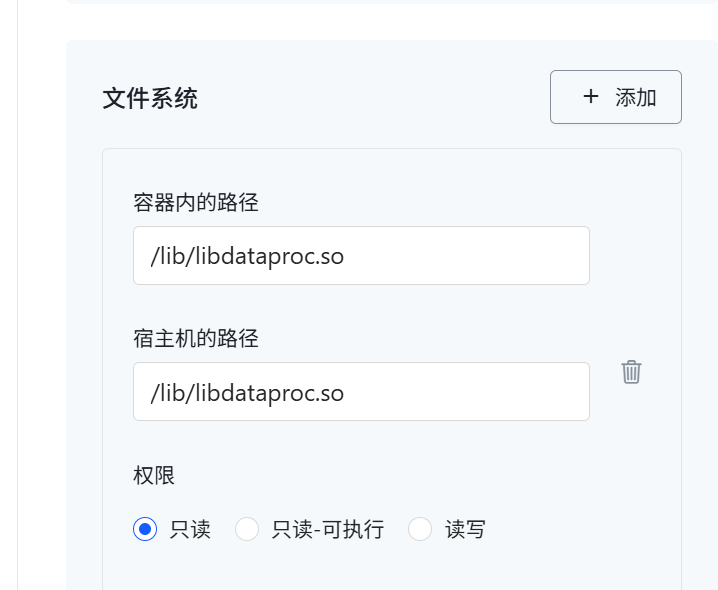

# 数据处理测试

1. 对数据处理模块的一些数学函数进行调用，看算力占用情况
2. 测试打包后的容器性能

✅ 测试目标
- 模拟传感器数据变化（陀螺仪、星敏感器）
- 调用数据处理函数进行姿态估计
- 模拟周期性执行（每 10ms 执行一次）

每 10ms 调用一次数据处理函数，模拟实时系统中的定时任务。使用 add_noise() 添加小幅度高斯噪声，模拟真实传感器测量值波动。敏感器四元数主值为 [1, 0, 0, 0]，其余三轴加入微小扰动。

所有结构体字段都进行了合理初始化，确保不会出现非法访问。标志位（如 .Flag, .OnFlag）保持活跃状态，便于观察正常流程。

## 微服务改造

将数据处理改造成服务端

将调用改造成客户端

选择通信模式为RPC

### RPC
#### 服务端开发
微服务对外提供RPC服务时，需要制定该RPC的URL资源标识并将该URL加入监听，同时需要制定RPC的回调函数用于处理RPC被调用时的逻辑。

```c
void GyroDataProcessing(FiberGyro Gyro1, MEMSGyro Gyro2, int OrbCtrlAllowFlag, double wbi_StarMeas[3]);
void StarDataProcessing(StarSensor Star1,StarSensor Star2, AttitudeData AttiData);
```

那么数据处理这个模块就是向外提供两个资源标识，供客户端RPC调用陀螺仪和星敏感器的数据处理服务

那么首先要将"数据处理"定义为一个`/dataproc`的资源标识，然后定义`/dataproc/gyro`和`/dataproc/star`两个子资源标识

##### 回调函数设计

客户端发送原始数据，服务器计算后返回结果；**客户端请求类型应为 RPC 调用或等价于 HTTP 的 POST 请求**

由于不清楚具体的业务逻辑，所以目前客户端和服务端之间通信的payload自定义如下,wbi_StarMeas由服务端默认填充：

```json
{
    "Gyro1": {
        "Flag": 1,
        "Meas": [0.01, 0.02, 0.03],
        "MtxInstall": [[1,0,0],[0,1,0],[0,0,1]],
        "FaultCnt": 0,
        "OnFlag": 1
    },
    "Gyro2": {
        "Flag": 1,
        "Meas": [0.02, 0.04, 0.06],
        "MtxInstall": [[1,0,0],[0,1,0],[0,0,1]],
        "FaultCnt": 0,
        "OnFlag": 1
    },
    "OrbCtrlAllowFlag": 1
}
```

 现在遇到一个问题，执行数据处理的这部分逻辑

```c
/* 角度制转弧度制输出 */
    wbi_meas[0] = wbi_meas[0] * PI/180.0; wbi_meas[1] = wbi_meas[1] * PI/180.0; wbi_meas[2] = wbi_meas[2] * PI/180.0;
    printf("wbi_meas: %f, %f, %f\n", wbi_meas[0], wbi_meas[1], wbi_meas[2]);
```

是直接在控制台打印结果，并没有返回值，也没有传递地址，所以对传递过来的参数并没有修改

**反序列化**

完成从json到结构体的反序列化，设计单元测试并通过


##### 编译打包部署

编写完函数主体后，需要对工程进行编译，在编译前需要进行一些Include路径和链接路径的设置

- 首先把 [computility.c](javascript:void(0))、[selfmath.c](javascript:void(0))、[AttiMeasFun.c](javascript:void(0)) 这三个 C 源文件分别编译成 `.o` 文件，其实编译工程的时候已经编译过了，在`/DEBUG/obj/src`目录下

- 设置`dataproc_server`工程的Include Path

  

- 设置`dataproc_server`工程的Linker Setting

  

  

现在是把dataproc的代码抽出来新建了一个动态链接库文件，需要上传到服务器上；静态链接好像直接在编译时直接连接到一起了，不需要上传。

目前动态链接后能够完成后续运行，暂时不修改

遇到问题（已解决）：打包的时候不知道怎么上传so文件




1. 512K内存单元分配？
2. 服务器端和客户端调通，相互通信
3. 先跑通软硬件架构，难点
   - 参数获取（决策需要的基础数据）
   - 故障处理模块在哪个层面，传到哪里，怎么传


卫星组：

- 开会确定板卡的所有材料
- 服务数据流、遥测参数表（参数具体的意义总结到文档里；顶一个变量）
- 先把程序编译起来，运行起来；提供硬件传感器，把外设连接到开发板，读取串口报文


进展：

1. 对于server端，服务名是注册到哪里了？位置服务中吗？所以如果想要以服务名而不是IP：端口号的方式访问，client和server必须都要绑定位置服务吗？
2. 直接编译成可执行文件client如果想要通过服务名称访问server
   - 开发位置服务
   - 能否利用ECSM的位置服务，如果可以，应该如何使用？

3. 容器内命令开放的太少，什么命令都没权限，没办法调试

4. 打包成ECS容器后，client和server的通信过程

   - client是可执行文件，server部署在容器内；
     - client选择硬编码，server容器部署选择自动映射端口：为什么会正好映射到33333？服务端程序里写的是33333，此时client能够和server成功连接
     - client选择硬编码，server容器部署选择33333端口：也可以成功访问到33333，暂时没搞清楚是否选择自动映射的区别，猜测如果client是通过服务名称访问，这样就很有用：即使映射到节点上的不是33333端口，位置服务能够自动将请求转发

   - client和server都部署在容器访问失败

     - 问题一：为什么执行失败

       ```go
       vsoa_position_lookup(AF_INET, "dataproc_server",
                                     (struct sockaddr *)&addr, &serv_len, NULL, &timeout)) 
       ```

     - 问题二：访问localhost:33333失败，这也是能够理解的，因为现在已经是一个新的容器了，是容器间通信，不是127.0.0.1了，硬编码自然会失败。为了这种妥协方式能够成功，我们把镜像的启动参数先不设置，我们在网页端登录之后手动启动app


问题：

1. client通过服务名访问失败（client容器部署 and client本机部署）
2. client通过ip访问失败（client容器部署）：修改成169.254.80.127成功